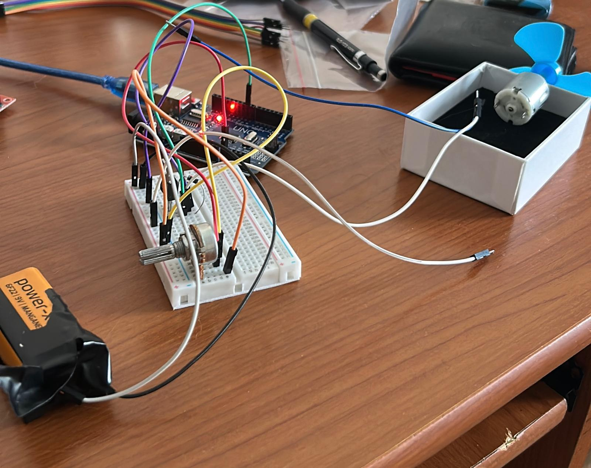

# DC Motor Speed Control with Potentiometer (Arduino)

This project demonstrates how to control the speed of a DC motor using PWM (Pulse Width Modulation) with a potentiometer and an Arduino.

## 🔧 Components Used

- 1 x Arduino Uno
- 1 x DC Motor
- 1 x TIP120 NPN Power Transistor (or equivalent)
- 1 x Potentiometer (10kΩ)
- 1 x Flyback Diode (e.g., 1N4007)
- 1 x 220Ω Resistor
- Jumper wires
- Breadboard
- External Power Supply (Optional)

## 🧠 How It Works

The potentiometer adjusts the voltage level on an analog input pin of the Arduino. The Arduino reads this analog value and maps it to a PWM signal that is output to the base of the TIP120 transistor, which drives the motor.

As you turn the potentiometer, the PWM signal changes, thus controlling the motor speed.

## 🔌 Circuit Diagram


## 💻 Arduino Code

The Arduino code reads the analog input from the potentiometer and outputs a corresponding PWM signal to control the transistor.

```cpp
int potPin = A0;       // Potentiometer connected to A0
int motorPin = 9;      // Motor control pin (PWM)

void setup() {
  pinMode(motorPin, OUTPUT);
}

void loop() {
  int potValue = analogRead(potPin);          // Read potentiometer
  int pwmValue = map(potValue, 0, 1023, 0, 255); // Scale to PWM
  analogWrite(motorPin, pwmValue);            // Control motor speed
}
```

## 🛠️ Setup Instructions

1. Connect the components according to the circuit diagram.
2. Upload the Arduino sketch (`motor_control.ino`) using the Arduino IDE.
3. Power the circuit and rotate the potentiometer to control the motor speed.

## 📂 Folder Structure

```
motor_control.ino
circuit_diagram.jpg
README.md
```

## 🧑‍🔬 Author

This project is developed for educational and demonstration purposes.  
Created by: [Can Deniz Aytekin]  
GitHub: [https://github.com/candenizaytkn]


## 📸 Real-Life Setup

Below is the actual setup of the project as built on a breadboard:


